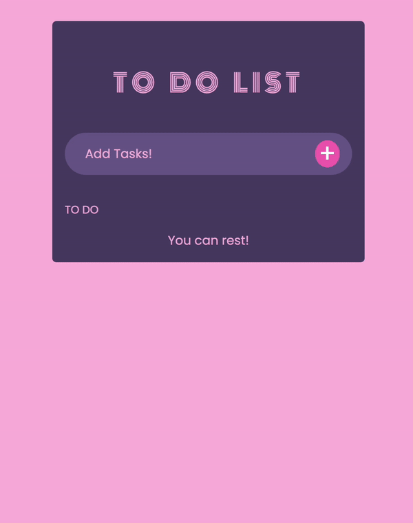

# 📝 ToDo-list 📝

you can try it here! : https://yuhyunjeong.github.io/ToDo-list/



## 💻 Process

### App Component

serves as the entry point to this Todo-List app

### TodoList Component

responsible for managing the list of tasks and handling task-related functionality

- update value of input box
- add tasks
- delete tasks
- check check box

### TodoItem Component

represents an individual task in Todo-List

## ✅ What I learned

### About React 💡

A JavaScript library for building user interfaces

### Install

```
npx create-react-app [project name]
```

### Components

All of the built-in browser components support some props and events

- input
  - onChange: <p></p>
    Fires immediately when the input’s value is changed by the user (for example, it fires on every keystroke)

### Hooks

let you use different React features from your components

- State Hooks

  ```
    import { useState } from "react"
  ```

  - State lets a component “remember” information like user input

### Props

arguments passed into React components via HTML attributes

### Array Methods

One of the most useful in React is the .map() array method

- .map()
  - allows you to run a function on each item in the array, returning a new array as the result

### Spread Operator

JavaScript spread operator (...) allows us to quickly copy all or part of an existing array or object into another array or object

### React icons

```
npm i react-icons
```

https://react-icons.github.io/react-icons/

## 🛠️ Trouble Shooting

### Objects are not valid as a react child

- Cause : Passing an Object as a React Child
- Solution : Rendering Object Properties
